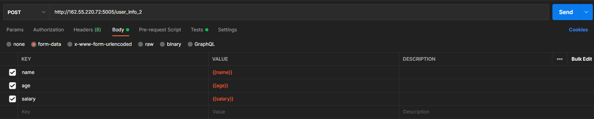

HW_2 Postman


http://162.55.220.72:5005/first
1. Отправить запрос.
2. Статус код 200
```
pm.test("Status code is 200", function () {
    pm.response.to.have.status(200);
});
```
3. Проверить, что в body приходит правильный string.
```
pm.test("Body matches string", function () {
    pm.expect(pm.response.text()).to.include("This is the first responce from server!");
});
```

http://162.55.220.72:5005/user_info_3
1. Отправить запрос.
2. Статус код 200
```
pm.test("Status code is 200", function () {
    pm.response.to.have.status(200);
});
```
3. Спарсить response body в json.
```
let jsonData = pm.response.json();
```
4. Проверить, что name в ответе равно name s request (name вбить руками.)
```
pm.test("Name is equal", function () {
    pm.expect(jsonData.name).to.eql("Dima");
});
```
5. Проверить, что age в ответе равно age s request (age вбить руками.)
```
pm.test("Age is equal", function () {
    pm.expect(jsonData.age).to.eql("22");
});
```
6. Проверить, что salary в ответе равно salary s request (salary вбить руками.)
```
pm.test("Salary is equal", function () {
    pm.expect(jsonData.salary).to.eql(500)
});
```
7. Спарсить request.
```
let req = request.data;
```
8. Проверить, что name в ответе равно name s request (name забрать из request.)
```
let reqName = req.name;
pm.test("Request name is equal", function () {
    pm.expect(jsonData.name).to.eql(reqName);
});
```
9. Проверить, что age в ответе равно age s request (age забрать из request.)
```
let reqAge = req.age;
pm.test("Request age is equal", function () {
    pm.expect(jsonData.age).to.eql(reqAge);
});
```
10. Проверить, что salary в ответе равно salary s request (salary забрать из request.)
```
let reqSalary = +req.salary;
pm.test("Request salary is equal", function () {
    pm.expect(jsonData.salary).to.eql(reqSalary)
});
```
11. Вывести в консоль параметр family из response.
```
console.log(jsonData.family)
```
12. Проверить что u_salary_1_5_year в ответе равно salary*4 (salary забрать из request)
```
let reqSalary = +req.salary;
let u_salary_1_5_year = reqSalary * 4
pm.test("Request u_salary_1_5_year is equal", function () {
    pm.expect(jsonData.family.u_salary_1_5_year).to.eql(u_salary_1_5_year)
});
```

http://162.55.220.72:5005/object_info_3
1. Отправить запрос.
2. Статус код 200
```
pm.test("Status code is 200", function () {
    pm.response.to.have.status(200);
});
```
3. Спарсить response body в json.
```
let jsonData = pm.response.json();
```
4. Спарсить request.
```
let req = pm.request.url.query.toObject();
```
5. Проверить, что name в ответе равно name s request (name забрать из request.)
```
let reqName = req.name;
pm.test("Request name is equal", function () {
    pm.expect(jsonData.name).to.eql(reqName);
});
```
6. Проверить, что age в ответе равно age s request (age забрать из request.)
```
let reqAge = req.age;
pm.test("Request age is equal", function () {
    pm.expect(jsonData.age).to.eql(reqAge);
});
```
7. Проверить, что salary в ответе равно salary s request (salary забрать из request.)
```
let reqSalary = +req.salary;
pm.test("Request salary is equal", function () {
    pm.expect(jsonData.salary).to.eql(reqSalary)
});
```
8. Вывести в консоль параметр family из response.
```
console.log(jsonData.family)
```
9. Проверить, что у параметра dog есть параметры name.
```
let jsonDataPets = jsonData.family.pets
pm.test("Dog has parameter name ", function () {
    pm.expect(jsonDataPets.dog).to.have.property('name')
})
```
10. Проверить, что у параметра dog есть параметры age.
```
pm.test("Dog has parameter age ", function () {
    pm.expect(jsonDataPets.dog).to.have.property('age')
})
```
11. Проверить, что параметр name имеет значение Luky.
```
pm.test("Dog name is Lucky", function () {
    pm.expect(jsonDataPets.dog.name).to.eql('Luky')
});
```
12. Проверить, что параметр age имеет значение 4.
```
pm.test("Dog age is 4", function () {
    pm.expect(jsonDataPets.dog.age).to.eql(4)
});
```

http://162.55.220.72:5005/object_info_4
1. Отправить запрос.
2. Статус код 200
```
pm.test("Status code is 200", function () {
    pm.response.to.have.status(200);
});
```
3. Спарсить response body в json.
```
let jsonData = pm.response.json();
```
4. Спарсить request.
```
let req = pm.request.url.query.toObject();
```
5. Проверить, что name в ответе равно name s request (name забрать из request.)
```
let reqName = req.name;
pm.test("Request name is equal", function () {
    pm.expect(jsonData.name).to.eql(reqName);
});
```
6. Проверить, что age в ответе равно age из request (age забрать из request.)
```
let reqAge = +req.age;
pm.test("Request age is equal", function () {
    pm.expect(jsonData.age).to.eql(reqAge);
});
```
7. Вывести в консоль параметр salary из request.
```
let reqSalary = +req.salary;
console.log(reqSalary)
```
8. Вывести в консоль параметр salary из response.
```
console.log(jsonData.salary)
```
9. Вывести в консоль 0-й элемент параметра salary из response.
```
console.log(jsonData.salary[0])
```
10. Вывести в консоль 1-й элемент параметра salary параметр salary из response.
```
console.log(jsonData.salary[1])
```
11. Вывести в консоль 2-й элемент параметра salary параметр salary из response.
```
console.log(jsonData.salary[2])
```
12. Проверить, что 0-й элемент параметра salary равен salary из request (salary забрать из request.)
```
pm.test("Response salary is equal to request salary", function () {
    pm.expect(jsonData.salary[0]).to.eql(reqSalary);
});
```
13. Проверить, что 1-й элемент параметра salary равен salary*2 из request (salary забрать из request.)
```
pm.test("Response salary is equal to request salary", function () {
    pm.expect(+jsonData.salary[1]).to.eql(reqSalary * 2);
});
```
14. Проверить, что 2-й элемент параметра salary равен salary*3 из request (salary забрать из request.)
```
pm.test("Response salary is equal to request salary", function () {
    pm.expect(+jsonData.salary[2]).to.eql(reqSalary * 3);
});
```
15. Создать в окружении переменную name
16. Создать в окружении переменную age
17. Создать в окружении переменную salary
18. Передать в окружение переменную name
19. Передать в окружение переменную age
20. Передать в окружение переменную salary
```
pm.collectionVariables.set("name", reqName);
pm.collectionVariables.set("age", reqAge);
pm.collectionVariables.set("salary", reqSalary);
```
21. Написать цикл который выведет в консоль по порядку элементы списка из параметра salary.
```
jsonData.salary.forEach((elem) => console.log(elem))
```

http://162.55.220.72:5005/user_info_2
1. Вставить параметр salary из окружения в request
2. Вставить параметр age из окружения в age
3. Вставить параметр name из окружения в name

4. Отправить запрос.
5. Статус код 200
```
pm.test("Status code is 200", function () {
    pm.response.to.have.status(200);
});
```
6. Спарсить response body в json.
```
let jsonData = pm.response.json();
```
7. Спарсить request.
```
let req = request.data;
```
8. Проверить, что json response имеет параметр start_qa_salary
```
pm.test("JSON response has parameter start_qa_salary", function () {
    pm.expect(jsonData).to.have.property('start_qa_salary')
})
```
9. Проверить, что json response имеет параметр qa_salary_after_6_months
```
pm.test("JSON response has parameter qa_salary_after_6_months", function () {
    pm.expect(jsonData).to.have.property('qa_salary_after_6_months')
})
```
10. Проверить, что json response имеет параметр qa_salary_after_12_months
```
pm.test("JSON response has parameter qa_salary_after_12_months", function () {
    pm.expect(jsonData).to.have.property('qa_salary_after_12_months')
})
```
11. Проверить, что json response имеет параметр qa_salary_after_1.5_year
```
pm.test("JSON response has parameter qa_salary_after_1.5_year", function () {
    pm.expect(jsonData).to.have.property('qa_salary_after_1.5_year')
})
```
12. Проверить, что json response имеет параметр qa_salary_after_3.5_years
```
pm.test("JSON response has parameter qa_salary_after_3.5_years", function () {
    pm.expect(jsonData).to.have.property('qa_salary_after_3.5_years')
})
```
13. Проверить, что json response имеет параметр person
```
pm.test("JSON response has parameter person", function () {
    pm.expect(jsonData).to.have.property('person')
})
```
14. Проверить, что параметр start_qa_salary равен salary из request (salary забрать из request.)
```
let reqSalary = +req.salary;
pm.test("start_qa_salary is equal to request salary", function () {
    pm.expect(jsonData.start_qa_salary).to.eql(reqSalary);
});
```
15. Проверить, что параметр qa_salary_after_6_months равен salary*2 из request (salary забрать из request.)
```
pm.test("qa_salary_after_6_months is equal to request salary*2", function () {
    pm.expect(jsonData.qa_salary_after_6_months).to.eql(reqSalary * 2);
});
```
16. Проверить, что параметр qa_salary_after_12_months равен salary*2.7 из request (salary забрать из request.)
```
pm.test("qa_salary_after_12_months is equal to request salary*2.7", function () {
    pm.expect(jsonData.qa_salary_after_12_months).to.eql(reqSalary * 2.7);
});
```
17. Проверить, что параметр qa_salary_after_1.5_year равен salary*3.3 из request (salary забрать из request.)
```
pm.test("a_salary_after_1.5_year is equal to request salary*3.3", function () {
    pm.expect(jsonData["qa_salary_after_1.5_year"]).to.eql(reqSalary * 3.3);
});
```
18. Проверить, что параметр qa_salary_after_3.5_years равен salary*3.8 из request (salary забрать из request.)
```
pm.test("qa_salary_after_3.5_years is equal to request salary*3.8", function () {
    pm.expect(jsonData["qa_salary_after_3.5_years"]).to.eql(reqSalary * 3.8);
});
```
19. Проверить, что в параметре person, 1-й элемент из u_name равен salary из request (salary забрать из request.)
```
pm.test("person u_name salary is equal to request salary", function () {
    pm.expect(responsePerson.u_name[1]).to.eql(reqSalary);
});
```
20. Проверить, что что параметр u_age равен age из request (age забрать из request.)
```
pm.test("person u_age is equal to request age", function () {
    pm.expect(responsePerson.u_age).to.eql(+reqAge);
});
```
21. Проверить, что параметр u_salary_5_years равен salary*4.2 из request (salary забрать из request.)
```
pm.test("person u_salary_5_years is equal to request salary*4.2", function () {
    pm.expect(responsePerson.u_salary_5_years).to.eql(reqSalary * 4.2);
});
```
22. ***Написать цикл который выведет в консоль по порядку элементы списка из параметра person.
```
for (key in responsePerson) {
    if (responsePerson.hasOwnProperty(key)) {
        if (Array.isArray(responsePerson[key])) {
			responsePerson[key].forEach((elem) => console.log(elem))
		}
        // console.log(`${key} : ${responsePerson[key]}`)
    }
}
```
